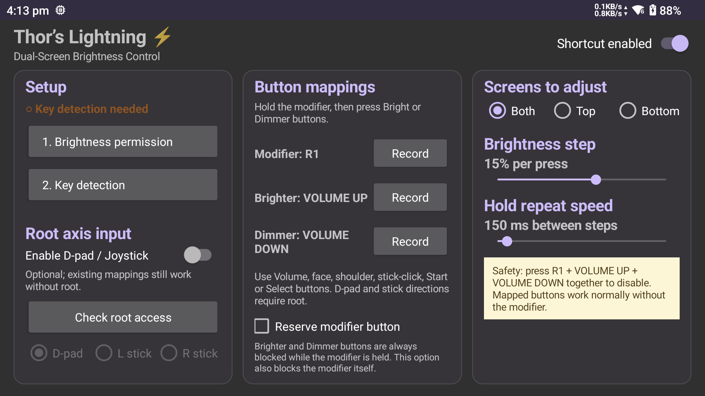

# Thor's Lightning

An unofficial Android utility for controller-driven dual-screen brightness
control on the AYN Thor. It has been tested on the February 2026 Android 13
firmware.

> **Unofficial project:** Thor's Lightning is an independent community utility.
> It is not developed, sponsored, endorsed, or supported by Shenzhen AYN
> Technologies Co., Ltd. AYN and Thor are used only to identify the compatible
> device. All related trademarks belong to their respective owners.



## What it does

- **Modifier-held brightness control:** hold a configurable controller button
  and press mapped Bright or Dimmer controls to adjust brightness.
- **Dual-screen targeting:** adjust the top screen, bottom screen, or both
  screens together.
- **Configurable mappings:** choose the modifier, Bright, and Dimmer controls
  from standard Android controller buttons.
- **Non-root volume support:** volume up and volume down work without root and
  are reserved while mapped for brightness.
- **Optional root input support:** rooted devices can also use D-pad and
  left/right analog-stick directions for Bright and Dimmer controls.
- **Modifier reservation option:** root users can optionally reserve the
  modifier itself while brightness controls are held.
- **Boot persistence:** Android can restart the accessibility service after
  reboot once the service has been enabled by the user.

The non-root path is built around Android's accessibility key-event handling.
Root input support is optional and exists for controls that Android does not
deliver through the same route.

## Requirements

- AYN Thor running the compatible Android 13 firmware
- Accessibility service enabled for Thor's Lightning
- Android brightness write permission
- Magisk root only if using D-pad or analog-stick mappings

Root axis input has platform limits. D-pad and stick directions may still be
visible to games, and analog sticks cannot physically send both directions on
the same axis at the same time. Use volume or standard buttons when complete
input reservation matters.

## Installation

1. Download the APK from the latest GitHub release.
2. Install it as a normal Android APK.
3. Open Thor's Lightning and complete **1. Brightness permission**.
4. Complete **2. Key detection** to enable its accessibility service.
5. Choose the modifier, Bright, Dimmer, and screen-target options.
6. Enable root input only if you want D-pad or analog-stick mappings.
7. Approve the Magisk root prompt if root input is enabled.

## Building

The project requires JDK 17 and Android SDK 35.

```bash
./gradlew :app:test :app:assembleRelease
```

The release build currently uses the Android debug signing key for direct
installation and update testing.

## Support scope

This app depends on AYN's dual-display Android behavior and Android's handling
of controller, accessibility, and rooted input events. Future firmware may
change those internals. Please include the device firmware version, root state,
selected mappings, screen target, and whether the issue happens in non-root or
root mode when reporting a problem.

## Development disclosure

This project was created under human direction with assistance from OpenAI
Codex. AI assistance was used for portions of the code, documentation, build
automation, icon generation, and test workflow. The device-specific behavior
and release APK were reviewed and tested by the project owner on real AYN Thor
hardware.

AI-assisted output can contain mistakes. Review the source and understand the
accessibility and optional root-input behavior before installing or modifying
the project.

## Changelog

### v1.5.0

- Added the Thor's Lightning app name and launcher icon.
- Added configurable modifier, Bright, and Dimmer mappings.
- Added top, bottom, and both-screen brightness targeting.
- Added optional root support for D-pad and analog-stick brightness mappings.
- Added clearer root, reservation, and setup prompts.

## License

Thor's Lightning's original source and icon are available under the
[MIT License](LICENSE). Third-party components retain their own licenses.
